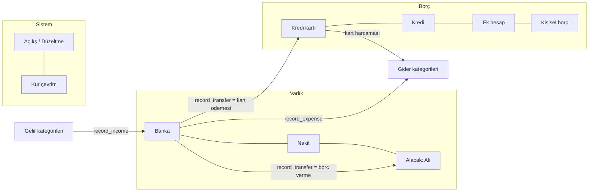

# Bütçe Defteri — Mimari

## 1. Temel karar: çift taraflı defter

Gereksinim dokümanının 63. bölümü "bakiye değil işlem ana veridir" diyor. Bu mimari o kararı bir adım ileri taşır: her işlem **çift taraflı muhasebe kaydı** olarak tutulur.

- `journal_entries` — işlemin başlığı (tarih, tür, açıklama, durum)
- `postings` — işlemin satırları. Her satır ya bir **hesaba** ya bir **kategoriye** yazılır.
- **Kural:** bir kaydın satırları, her para biriminde toplamda **0** olmak zorundadır. Veritabanı, dengesiz bir kaydın commit edilmesine izin vermez.

İşaret kuralı: `+` borç (debit), `−` alacak (credit).

| Ne | Nasıl hesaplanır |
|---|---|
| Banka / nakit / alacak bakiyesi | `Σ amount` |
| Kart / kredi / ek hesap / kişisel borç | `−Σ amount` (borçlu olunan tutar) |
| Gider kategorisi toplamı | `Σ amount` |
| Gelir kategorisi toplamı | `−Σ amount` |

### Bu yapı dokümandaki 5 kritik hatayı nasıl imkânsız kılar

| Doküman §37 | Çözüm |
|---|---|
| Kart harcaması + kart ödemesi çift gider | Harcama: `Gider +5.000 / Kart −5.000`. Ödeme: `Kart +5.000 / Banka −5.000`. Ödemede kategori satırı yok → gider oluşmaz. |
| Transfer gelir sayılır | Transfer yalnız iki hesap satırıdır; gelir kategorisine hiç dokunmaz. |
| Kredi anaparası gider sayılır | Taksit: `Kredi +anapara`, `Kredi Faizi gideri +faiz`, `Banka −taksit`. Sadece faiz gider olur. |
| Aynı işlemin iki kez kaydı | Her istek bir `idempotency_key` taşır; aynı anahtar ikinci kez kayıt açmaz. |
| Silinen işlemin etkisi sürer | Silme yok. İptal = aynı tarihli ters kayıt. Bakiye her zaman satırların toplamıdır. |

## 2. Her şey bir hesap



Transferin türü, kaynak ve hedef hesabın türünden otomatik çıkarılır:

| Nereden → Nereye | Kayıt türü |
|---|---|
| Banka → Kart | Kart ödemesi |
| Kredi → Banka | Kredi kullanımı |
| Banka → Kredi | Kredi ödemesi (anapara) |
| Banka → Alacak | Borç verildi |
| Alacak → Banka | Alacak tahsilatı |
| Kişisel borç → Banka | Borç alındı |
| Banka → Kişisel borç | Borç ödendi |
| USD → TL | Döviz çevirme |

Kullanıcı tek bir "Transfer / Ödeme" ekranı görür; sistem doğru muhasebeyi yazar.

## 3. Çoklu para birimi

Her hesabın tek bir para birimi vardır. Farklı birimler arası transferde "Kur çevrim" sistem hesapları kullanılır, böylece her birim kendi içinde dengede kalır:

```
USD hesabı      −500 USD
Kur çevrim USD  +500 USD
Kur çevrim TRY  −17.100 TRY
Ziraat TL       +17.100 TRY
```

İşlem anındaki kur, iki tutarın oranı olarak kalıcı olarak kayıtlıdır; geçmiş raporlar kur değişince bozulmaz.

## 4. Katmanlar

```
React + TypeScript (Vite, PWA)            ← sadece gösterir, hesaplamaz
        │  supabase-js
        ▼
PostgREST / RPC
  • Okuma: v_account_balances, v_net_position, v_entries,
           v_category_monthly, v_month_summary, net_worth_history()
  • Yazma: create_account, record_income, record_expense, record_transfer,
           record_split_expense, adjust_balance, reverse_entry
        ▼
PostgreSQL (Supabase)
  • RLS: kullanıcı yalnız kendi satırlarını görür
  • Defter tabloları istemciye SADECE OKUMA
  • Tetikleyiciler: denge, limit, nakit ≥ 0, değişmezlik, audit
```

Doküman §36'daki "kritik finansal değerler yalnız frontend'de hesaplanmamalı" şartı böylece tam karşılanır: istemci deftere doğrudan yazamaz.

## 5. Veritabanı seviyesinde garanti edilen kurallar

1. Her kayıt en az iki satır içerir ve her para biriminde 0'a kapanır.
2. Hesap satırının para birimi hesabın birimiyle aynıdır.
3. Kart ve ek hesap borcu limiti aşamaz; nakit eksiye düşemez.
4. Defter satırları güncellenemez/silinemez (yönetici dahil, tetikleyiciyle).
5. Kayıtta sadece açıklama düzeltilebilir; tarih/tür değişmez.
6. Hareket görmüş hesabın türü ve para birimi değişmez.
7. Kategoriler en fazla iki seviyelidir, alt kategori ana ile aynı türdedir.
8. Gelecek tarihli işlem deftere yazılamaz → planlı işlemlere gider.
9. Hesap, kart detayı, kategori, bütçe ve kayıt durum değişiklikleri `audit_log`'a yazılır.

## 6. Gerçekleşen ↔ planlanan ayrımı

Defter yalnızca **olmuş** işlemleri tutar. Beklenen maaş, gelecek kira, kredi taksit planı, kart taksitleri `scheduled_items` tablosunda durur. Nakit akışı projeksiyonu (§25-26):

```
Bugünkü bakiye (defterden)  +  planlanan girişler  −  planlanan çıkışlar  =  tahmini nakit
```

Planlı kalem gerçekleşince deftere kayıt atılır ve `realized_entry_id` ile bağlanır.

## 7. Faz 2–6 nasıl kuruldu

**Kart ekstresi saklanmaz, hesaplanır.** Kesim tarihi C için:
`Ekstre(C) = C günündeki kart borcu − C'den sonra faturalanacak taksit dilimleri`.
Devreden bakiye kendiliğinden içindedir; ödeme yapıldıkça kalan düşer, geçmiş ekstre asla "bayatlamaz".
Taksitli alışverişte gider ve limit blokajı alışveriş günü tam tutardır (Türk kart mantığı), ekstreye dilim dilim girer.

**Kredi:** annüite planı (aylık faiz + isteğe bağlı KKDF/BSMV) `loan_installments`'a yazılır.
Taksit ödemesi tek kayıttır: `Kredi +anapara · Kredi Faizi +faiz+vergi · Banka −taksit`. Taksit ödemesi iptal edilirse taksit yeniden açılır.
Ödemesi süren kredi "şu kadar taksit ödendi" bilgisiyle eklenir; kalan anapara plandan hesaplanıp açılış borcu olur.

**Planlı kalemler:** düzenli kurallar 120 gün ilerisi için `scheduled_items`'a açılır (tekrar çalıştırmak çift üretmez; kural değişince bekleyenler yenilenir).
Borç/alacak taksit planları da aynı tabloda. "Gerçekleşti" denince doğru defter kaydı atılır ve kalem kapanır.

**Yaklaşan ödemeler (`upcoming_items`)** = planlı kalemler + kredi taksitleri + kart ekstre ödemeleri + gelecek taksit dilimleri.
Nakit akışı projeksiyonu, bildirimler, takvim ve özet ekranı bu tek kaynaktan beslenir.

**Bütçe:** ana kategori bütçesi alt kategorilerin toplamını izler; eşikler kullanıcı ayarıdır (%70 dikkat / %90 kritik / %100+ aşıldı).

**Kur:** kullanıcı kuru elle girer; doğrudan → ters → USD üzerinden çapraz kur. Baz para biriminde toplam net varlık özet ekranında.

**Belgeler:** Storage `attachments` kovası, yol `<kullanıcı>/<kayıt>/<dosya>`; RLS ile yalnız sahibi erişir.

## 8. Fazlar

| Faz | Durum | İçerik |
|---|---|---|
| 1 Core | ✓ | Giriş, özet, hesaplar, gelir, gider, transfer, döviz, kategoriler, iptal, mutabakat |
| 2 Borç | ✓ | Kart ekstre motoru + taksit, kredi amortismanı + taksit ödeme, borç/alacak taksit planı |
| 3 Bütçe | ✓ | Aylık kategori bütçeleri, uyarı seviyeleri, geçen aydan kopyalama |
| 4 Analiz | ✓ | 30/60/90 gün nakit akışı + grafik, net varlık grafiği, KPI'lar |
| 5 Otomasyon | ✓ | Düzenli işlemler, planlı kalemler, takvim, uygulama içi bildirimler |
| 6 Gelişmiş | ✓ | Fiziksel varlıklar, kur çevirisi, belge yönetimi, PDF (yazdır) ve CSV dışa aktarma |

Bilinçli olarak dışarıda bırakılanlar (doküman §55): banka API entegrasyonu, otomatik kur/fiyat çekme, hisse/kripto portföyü, yapay zekâ danışman, OCR, e-posta/push bildirimi (Edge Function + cron gerektirir).
